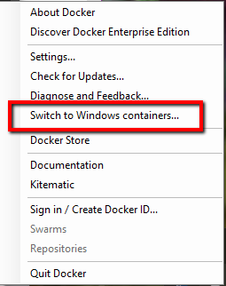
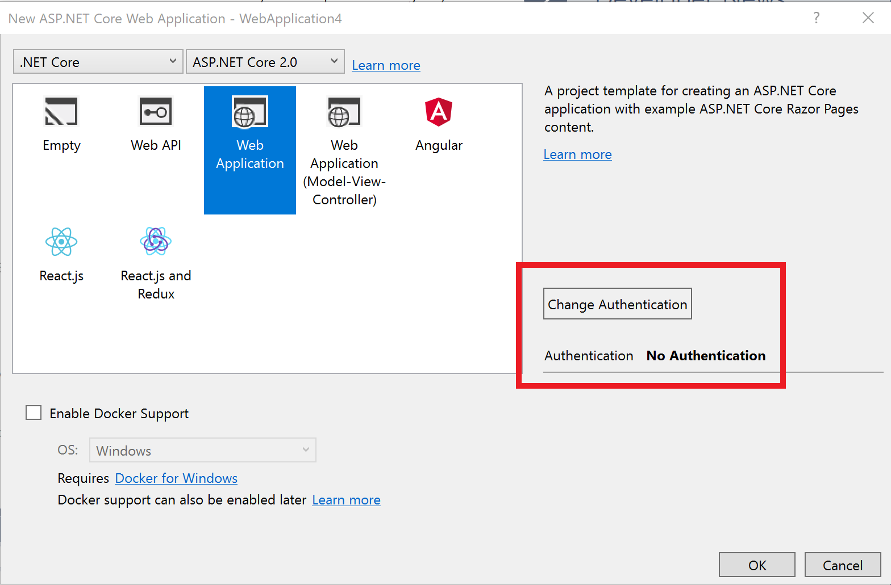
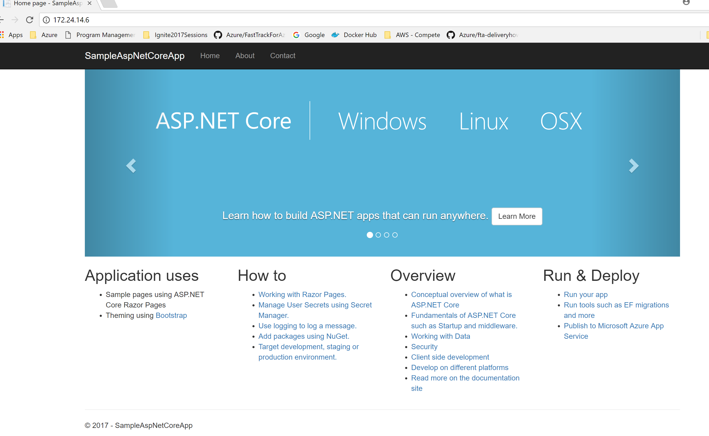

# POC Walkthrough - Run ASP.NET Core Application on Windows Containers

## Introduction
In this walkthrough, we will go over the basic steps necessary to run an ASP.NET Core application on a Windows Container image.

## Prerequisites
* Visual Studio 2017 with the *ASP.NET and web development* workload selected
* [Docker for Windows](https://www.docker.com/docker-windows)
* Windows 10 or Windows Server
* [.NET Core 2.x or above](https://www.microsoft.com/net/download/visual-studio-sdks)

## Walkthrough
1. Make sure Docker for Windows is configured to run Windows Containers.
2. In the Windows taskar, right-click the Docker for Windows Icon and select **Switch to Windows Containers**

    

    > Note: This may require additional components to be installed on your machine which will force a reboot.
3. Once switched, open Visual Studio 2017. Create a new ASP.NET Core Web Application project.
    > Note: We want to ensure we select .NET Core, NOT Full .NET Framework
    
    

4. For the application template, select **Web Application** and ensure that Authentication is set to **No Authentication**. Click **Ok**.
     
    

5. Once the application is created, navigate to the solution location in Windows folder and create a file called **Dockerfile**. Note that the Dockerfile is at the same level as the solution file. Add the following to the Dockerfile

    

```
FROM microsoft/dotnet:2.0-sdk-nanoserver
 ENTRYPOINT ["dotnet", "bin/Debug/netcoreapp2.0/SampleAspNetCoreApp.dll"]
 WORKDIR dockerdemo
 ADD ./SampleAspNetCoreApp .
 RUN dotnet restore SampleAspNetCoreApp.csproj
 RUN dotnet build SampleAspNetCoreApp.csproj
 EXPOSE 80
 ENV ASPNETCORE_URLS http://0.0.0.0:80

```       

8. Open a PowerShwll prompt to the same folder as the Dockerfile. Run the following command to build the Docker image
    ```
    docker build -t fezcontainerreg.azurecr.io/sampleaspnetcorecontainerized:1.0 .
    ```
9. The container will start to download and install and you should see output similar to that below:
    
    
    > Note: Docker naming covention is to use reponame/imagename:version
    
10. Once the container is built, you can run `docker media` and see the new .NET Core container listed
   
    

11. To run the container, execute the following
    ```
    docker run --name youraspnetcore fezcontainerreg.azurecr.io/sampleaspnetcorecontainerized:1.0
    ```

12. Run `docker ps`
    to see the container running.
       
    

13. You can get the IP being used by the container through running the following command:       
    
    ```
    docker inspect -f "{{ .NetworkSettings.Networks.nat.IPAddress }}" youraspnetcore
    ```

    

14. We can open a brower to this url `http://{IPAddress}` and we should see the site running.
       
    
